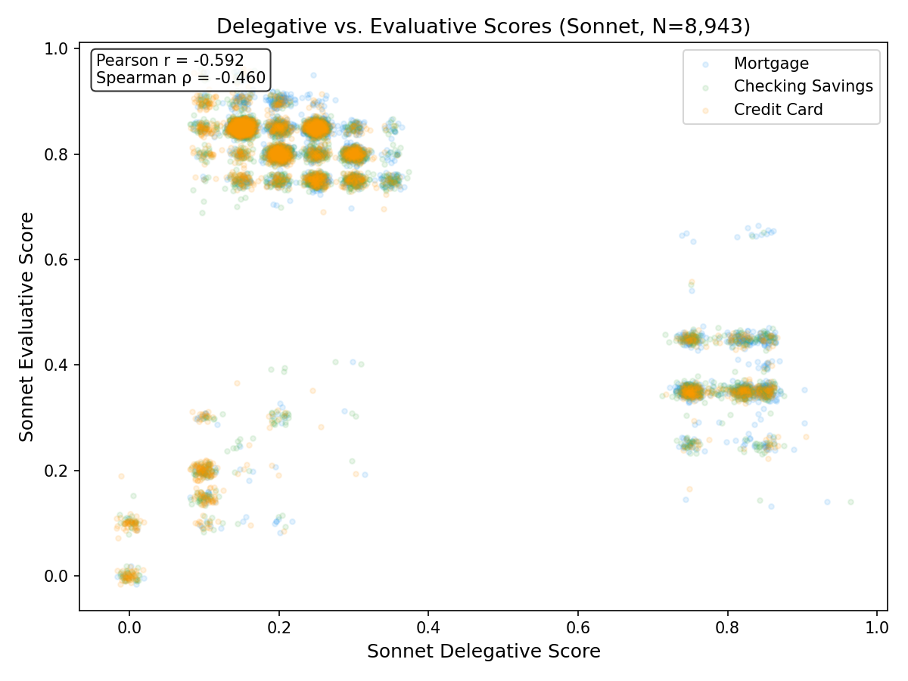

# Within-Product Analysis Results

*Generated: 2026-02-26*

---

## Analysis 1: Delegative × Evaluative Score Correlations

**Purpose:** Test whether delegative and evaluative scores are independent dimensions 
(weak/no correlation) or a single 'complaint intensity' dimension (strong positive correlation).

| Dataset | Product | N | Pearson r | p-value | Spearman ρ | p-value |
|---------|---------|--:|----------:|--------:|-----------:|--------:|
| Sonnet | Overall | 8943 | -0.5921 | 0.00e+00 *** | -0.4601 | 0.00e+00 *** |
| Sonnet | mortgage | 2974 | -0.8066 | 0.00e+00 *** | -0.6351 | 0.00e+00 *** |
| Sonnet | checking_savings | 2985 | -0.5885 | 9.74e-278 *** | -0.4778 | 4.28e-170 *** |
| Sonnet | credit_card | 2984 | -0.4005 | 2.13e-115 *** | -0.2847 | 9.65e-57 *** |
| GPT-4o | Overall | 8943 | -0.5742 | 0.00e+00 *** | -0.5048 | 0.00e+00 *** |
| GPT-4o | mortgage | 2974 | -0.7705 | 0.00e+00 *** | -0.6627 | 0.00e+00 *** |
| GPT-4o | checking_savings | 2985 | -0.5614 | 1.70e-247 *** | -0.5147 | 1.37e-201 *** |
| GPT-4o | credit_card | 2984 | -0.3969 | 3.80e-113 *** | -0.3489 | 3.76e-86 *** |
| Concordant Avg | Overall | 7369 | -0.5611 | 0.00e+00 *** | -0.4346 | 0.00e+00 *** |
| Concordant Avg | mortgage | 2472 | -0.8184 | 0.00e+00 *** | -0.6133 | 2.42e-255 *** |
| Concordant Avg | checking_savings | 2405 | -0.5583 | 3.57e-197 *** | -0.4565 | 4.35e-124 *** |
| Concordant Avg | credit_card | 2492 | -0.3100 | 1.24e-56 *** | -0.2500 | 8.17e-37 *** |

**Interpretation:** The overall Pearson correlations between delegative and evaluative scores are **moderate-to-strong** and **negative** (Sonnet r = -0.592, GPT-4o r = -0.574, Concordant Avg r = -0.561), raising questions about dimensional independence.



---

## Analysis 2: Narrative Length by Trust Classification

**Purpose:** Rule out the alternative explanation that delegative classification is just a proxy 
for longer/more detailed complaints.

### Sonnet Classifications

| Product | Classification | N | Mean Chars | Median Chars | SD |
|---------|----------------|--:|----------:|-----------:|-----:|
| mortgage | EVALUATIVE | 2274 | 1590 | 1122 | 1751 |
| mortgage | DELEGATIVE | 625 | 2144 | 1589 | 2161 |
| mortgage | UNCLASSIFIABLE | 75 | 1637 | 715 | 2821 |
| checking_savings | EVALUATIVE | 2328 | 1230 | 905 | 1089 |
| checking_savings | DELEGATIVE | 485 | 1889 | 1419 | 1905 |
| checking_savings | UNCLASSIFIABLE | 172 | 664 | 456 | 604 |
| credit_card | EVALUATIVE | 2361 | 1305 | 963 | 1210 |
| credit_card | DELEGATIVE | 367 | 1798 | 1509 | 1129 |
| credit_card | UNCLASSIFIABLE | 256 | 867 | 470 | 1103 |

### GPT-4o Classifications

| Product | Classification | N | Mean Chars | Median Chars | SD |
|---------|----------------|--:|----------:|-----------:|-----:|
| mortgage | EVALUATIVE | 2191 | 1539 | 1129 | 1435 |
| mortgage | DELEGATIVE | 589 | 2562 | 1855 | 3007 |
| mortgage | UNCLASSIFIABLE | 194 | 1022 | 692 | 1050 |
| checking_savings | EVALUATIVE | 2127 | 1264 | 955 | 1112 |
| checking_savings | DELEGATIVE | 395 | 2047 | 1459 | 2034 |
| checking_savings | UNCLASSIFIABLE | 463 | 857 | 620 | 745 |
| credit_card | EVALUATIVE | 2268 | 1305 | 1002 | 1124 |
| credit_card | DELEGATIVE | 262 | 2236 | 1787 | 1745 |
| credit_card | UNCLASSIFIABLE | 454 | 924 | 612 | 960 |

### Regression: Does Narrative Length Predict Delegative Score?

Model: `sonnet_delegative_score ~ log(char_count) + product_dummies`

```
                              Coef.  Std.Err.          t          P>|t|    [0.025    0.975]
const                     -0.242847  0.021298 -11.402216   6.556901e-30 -0.284597 -0.201098
log_chars                  0.078889  0.003045  25.904207  1.003958e-142  0.072919  0.084858
product_group_credit_card -0.038060  0.005723  -6.650368   3.095012e-11 -0.049278 -0.026841
product_group_mortgage     0.015653  0.005779   2.708818   6.765199e-03  0.004326  0.026981
```

**Length coefficient:** 0.0789 (p = 1.00e-142)

**Length is a SIGNIFICANT predictor** of delegative score after controlling for product type.

### Cross-Product Delegative Gradient: Raw vs. Length-Controlled

| Product | Raw Mean Deleg. Score | Residualized Mean |
|---------|---------------------:|-----------------:|
| mortgage | 0.3344 | +0.0227 |
| checking_savings | 0.2988 | +0.0078 |
| credit_card | 0.2630 | -0.0304 |

- **Raw gradient (max − min):** 0.0714
- **Residualized gradient (max − min):** 0.0531
- **Gradient retained after length control:** 74.3%

**The cross-product delegative gradient survives length control** — narrative length does not explain away the between-product differences in delegative trust.

---

## Analysis 3: Company Concentration Within Mortgages (Exploratory)

**Purpose:** Check whether certain mortgage companies generate disproportionately more delegative complaints, 
suggesting institutional behavior drives trust mode.

Companies with ≥50 mortgage narratives: **15**

### Top 10 by Delegative Proportion

| Company | Total | Evaluative | Delegative | Unclass. | Deleg. % |
|---------|------:|----------:|----------:|--------:|---------:|
| WELLS FARGO & COMPANY | 241 | 136 | 91 | 14 | 37.8% |
| BANK OF AMERICA, NATIONAL ASSOCIATION | 116 | 72 | 39 | 5 | 33.6% |
| JPMORGAN CHASE & CO. | 95 | 66 | 27 | 2 | 28.4% |
| Ocwen Financial Corporation | 173 | 124 | 44 | 5 | 25.4% |
| NATIONSTAR MORTGAGE LLC | 81 | 60 | 20 | 1 | 24.7% |
| U.S. BANCORP | 56 | 40 | 13 | 3 | 23.2% |
| SELECT PORTFOLIO SERVICING, INC. | 107 | 81 | 23 | 3 | 21.5% |
| Ditech Financial LLC | 71 | 56 | 15 | 0 | 21.1% |
| Rocket Mortgage, LLC | 63 | 49 | 12 | 2 | 19.0% |
| Mr. Cooper Group Inc. | 152 | 121 | 26 | 5 | 17.1% |

### Bottom 10 by Delegative Proportion

| Company | Total | Evaluative | Delegative | Unclass. | Deleg. % |
|---------|------:|----------:|----------:|--------:|---------:|
| U.S. BANCORP | 56 | 40 | 13 | 3 | 23.2% |
| SELECT PORTFOLIO SERVICING, INC. | 107 | 81 | 23 | 3 | 21.5% |
| Ditech Financial LLC | 71 | 56 | 15 | 0 | 21.1% |
| Rocket Mortgage, LLC | 63 | 49 | 12 | 2 | 19.0% |
| Mr. Cooper Group Inc. | 152 | 121 | 26 | 5 | 17.1% |
| Specialized Loan Servicing Holdings LLC | 72 | 59 | 12 | 1 | 16.7% |
| Freedom Mortgage Company | 99 | 81 | 16 | 2 | 16.2% |
| Shellpoint Partners, LLC | 185 | 154 | 29 | 2 | 15.7% |
| PENNYMAC LOAN SERVICES, LLC. | 52 | 44 | 7 | 1 | 13.5% |
| LoanCare, LLC | 83 | 80 | 3 | 0 | 3.6% |

**Spread:** Delegative proportion ranges from 3.6% to 37.8% across qualifying companies (spread = 34.2 percentage points).
